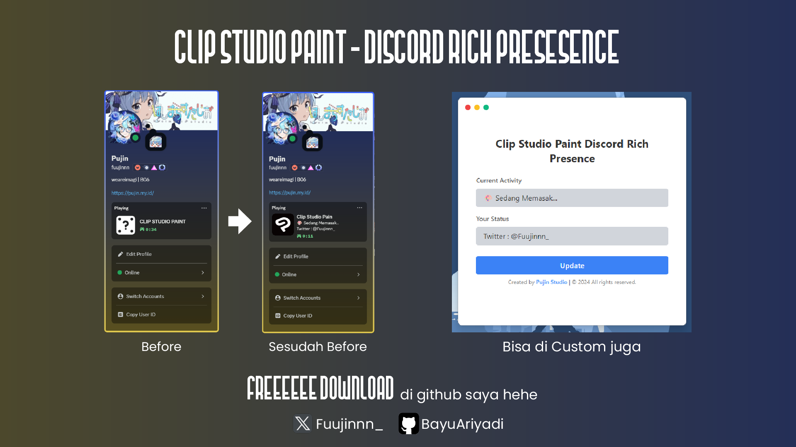

# CSP-RPC (Clip Studio Paint Discord Rich Presence Configurator)

CSP-RPC adalah aplikasi yang memungkinkan Anda untuk mengatur **Rich Presence** di Discord saat menggunakan **Clip Studio Paint**. Aplikasi ini memungkinkan Anda untuk mengubah status dan detail aktivitas yang muncul di profil Discord Anda, memberikan pengalaman lebih interaktif dan menyenangkan ketika Anda menggambar atau bekerja di Clip Studio Paint.

---

## Fitur
- **Update Discord Rich Presence**: Menampilkan informasi seperti aktivitas dan status yang dapat dibagikan kepada teman-teman Discord Anda.
- **Mode Gelap & Terang**: Dukungan untuk mode gelap dan terang sesuai dengan preferensi sistem Anda.
- **Mudah Digunakan**: Antarmuka pengguna yang sederhana dengan dua input utama: **Details** dan **State**.

---

## Cara Instalasi

Ikuti langkah-langkah di bawah ini untuk menginstal dan menjalankan CSP-RPC di komputer Anda.

### Prasyarat
- **Node.js** versi 18 atau lebih baru.
- **Discord** terpasang di komputer Anda.

### Langkah 1: Unduh dan Instal
1. Kunjungi halaman **[CSP-RPC di GitHub](https://github.com/BayuAriyadi/CSP-RPC)**.
2. Unduh file installer **Windows (.exe)** yang sesuai dengan versi aplikasi terbaru.
3. Jalankan installer dan ikuti instruksi untuk menyelesaikan instalasi.

### Langkah 2: Menjalankan Aplikasi
1. Setelah instalasi selesai, buka aplikasi **CSP-RPC**.
2. Anda akan melihat antarmuka yang memungkinkan Anda untuk mengubah aktivitas yang Anda lakukan di Clip Studio Paint dan status Discord.

---

## Cara Menggunakan Aplikasi

### 1. **Mengubah Aktivitas (Current Activity)**

   - Di aplikasi, temukan kolom **Current Activity**.
   - Masukkan deskripsi tentang apa yang sedang Anda lakukan, seperti "Sketching a new character" atau "Drawing a background".
   - Ini adalah informasi yang akan ditampilkan di Discord, memberi tahu teman-teman Anda apa yang sedang Anda kerjakan.

### 2. **Mengubah Status (Your Status)**

   - Di kolom **Your Status**, masukkan informasi terkait status yang ingin Anda tampilkan. Misalnya: 
     - "Playing around with brushes"
     - "Working on a commission"
   - Status ini akan memberi tahu teman-teman Anda tentang aktivitas sosial Anda di Discord.

### 3. **Mengupdate Discord Rich Presence**
   
   - Setelah Anda memasukkan **Current Activity** dan **Your Status**, klik tombol **Update** untuk memperbarui status Discord Anda.
   - Setiap kali Anda ingin mengubah aktivitas atau status, cukup perbarui kolom yang relevan dan klik **Update** lagi.

---

## Tangkapan Layar
  

---

## Pembaruan Aplikasi
Jika Anda ingin memperbarui aplikasi ke versi terbaru, cukup unduh versi terbaru dari halaman **[GitHub Releases](https://github.com/BayuAriyadi/CSP-RPC/releases)** atau jalankan pembaruan otomatis jika fitur tersebut didukung.

---

## Masalah yang Diketahui
- Beberapa pengguna mungkin mengalami kesulitan saat menggunakan aplikasi di sistem dengan hak akses terbatas. Pastikan aplikasi dijalankan dengan hak administrator jika terjadi kesalahan.

---

## Dukungan dan Kontribusi
Jika Anda mengalami masalah atau memiliki pertanyaan, silakan buka **[Issue](https://github.com/BayuAriyadi/CSP-RPC/issues)** di repositori GitHub ini.

Jika Anda tertarik untuk berkontribusi, silakan fork repositori ini dan kirim pull request dengan perubahan Anda!

Jika anda ingin memberikan dukungan berupa donasi silahkan mampir ke **[Saweria](https://saweria.co/pujin)** saya.

---

## Lisensi
Aplikasi ini dilisensikan di bawah **MIT License**. Untuk detail lebih lanjut, lihat [LICENSE](./LICENSE).

---

## Pembuat
**Pujin Studio** a.k.a **Fuujin**  
[Website](https://pujin.my.id/)

---

### Catatan: 
Jika Anda ingin menyesuaikan gaya atau menambahkan fitur lain, Anda dapat dengan mudah memodifikasi aplikasi ini dan berkontribusi di repositori GitHub.
